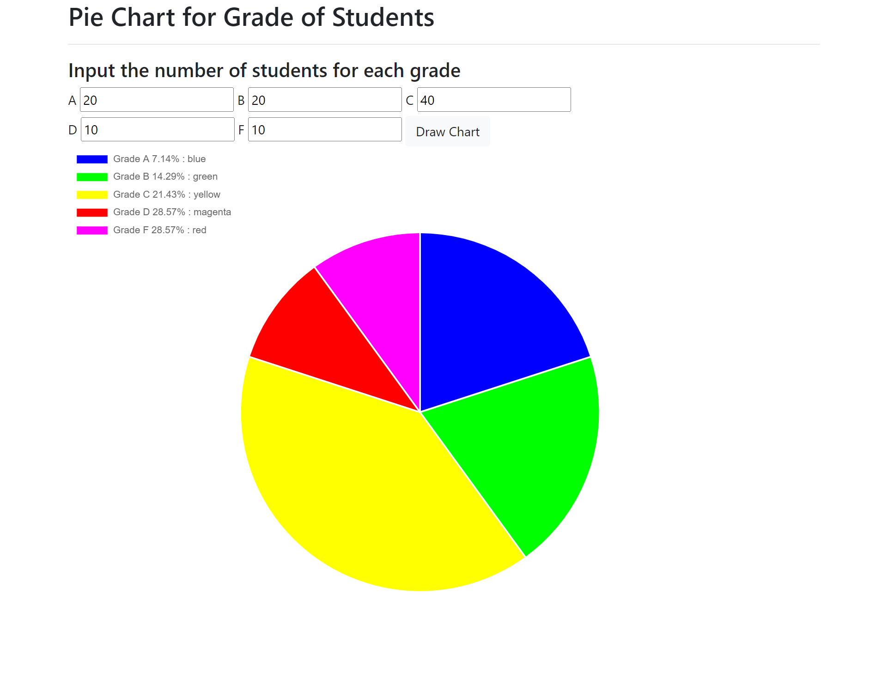

# Pie Chart

Generate pie chart of the students per grade level.
User will input the number of students per grade level.

### Technologies
1. HTML
2. Bootstrap 4
3. Javascript (Chart.js v3.7.1)

### Screenshot

